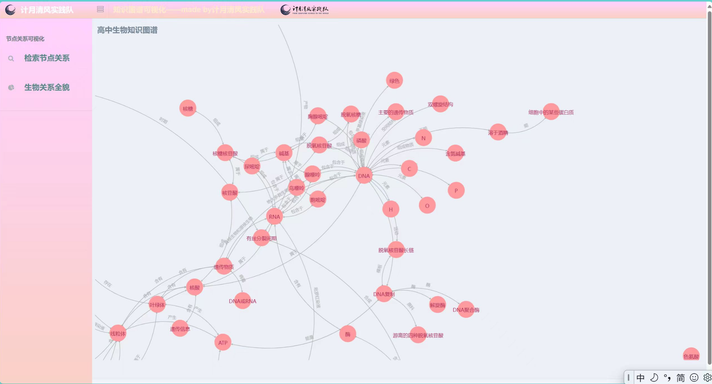
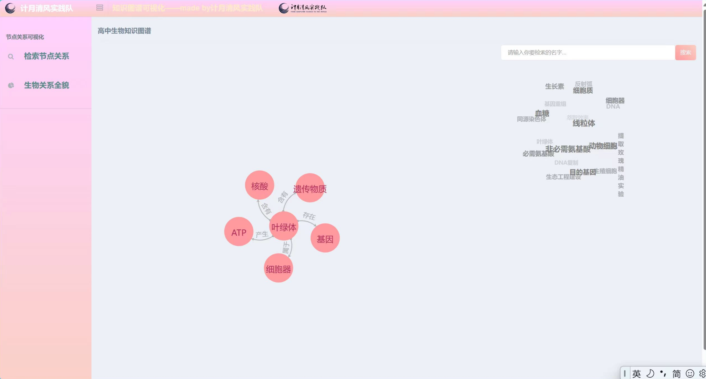

# 生物知识图谱可视化及节点查询系统
## 背景
随着信息技术的发展，教育领域逐渐向数字化转型。高中知识尤其是高中生物知识，涉及大量的复杂概念、关系和过程，在传统的教学方式下，学生很难获得对知识的整体性认知，并将在不同时期学到的知识点串联起来。知识图谱作为一种前沿技术，可以通过将知识点以节点和关系的形式呈现，帮助学生构建全面的知识网络，提升学习效率。本系统将以生物学科为例，展示知识图谱在教学中的应用。
## 需求
当前教育环境下，学生普遍面临以下挑战
- 知识碎片化：传统的学习方式难以将各个知识点有机结合，学生在理解和应用知识时常感到困难
- 学习内容多：生物课程内容繁杂，学生在有效时间内难以高效掌握所有知识点
- 缺乏互动性：传统教育资源多为静态，学生以接收为主，参与度并不高，难以激发学习兴趣

因此，需要一种工具能够将生物知识系统化、可视化，并增强学生在学习中的主动性，帮助他们更好地掌握和应用所学内容
## 功能

针对以上需求，本知识图谱产品设计了以下功能：

- 节点关系搜索：用户可以输入特定的生物概念或关键词，系统将返回该节点与其他知识点的关联，帮助用户快速了解相关内容。

- 生物关系全貌：提供对生物学科整体关系的可视化展示，包括分类学、生物过程、生物分子等多维度信息，帮助学生从宏观上理解学科结构。

- 知识点深度解析：点击节点后，用户可以看到该知识点的详细解释、相关案例、常见问题及其与其他知识点的联系。

- 智能测试与反馈：基于知识图谱自动生成个性化测试题，学生完成后系统会提供详细的分析报告，指出薄弱环节并推荐复习策略。

## 目标
预期达到如下目标

- 提升学习效果：通过系统化和可视化的知识展示，帮助学生更好地理解和记忆生物知识。
- 减轻学习负担：通过智能测试与个性化学习路径推荐，帮助学生高效复习，减少盲目学习带来的压力。
- 激发学习兴趣：通过互动性强的功能设计，让学生在探索知识的过程中保持高参与度。

## 文件树介绍

```
1..venv 文件夹是使用 python 中的 venv 创建的虚拟环境，可以换成自己的虚拟环境
2.neo_db 文件夹是知识图谱的构建模块
	|-config.py 配置参数
	|-create_graph.py 创建知识图谱，图数据库的建立
	|-query_graph.py 知识图谱的查询
3.raw_data 文件夹是存在数据处理后的三元组文件
4.static 文件夹存放css和js，是页面的样式和效果的文件
	|-csv2json.py 创建web端显示出的知识图谱json文件
5.templates 文件夹是HTML的页面
	|-index.html 欢迎界面
	|-search.html 查询关系的页面
	|-all_relation.html 所有关系的页面
6.app.py 是整个系统的主入口
7.requirement 是环境需求
```

## 部署步骤

1. 安装好python所需要的库，执行命令

   ```
   pip install -r requirement.txt
   ```

2. 下载好neo4j图数据库，并配好环境（注意neo4j需要jdk8）。修改neo_db文件夹下的配置文件config.py,设置图数据库的账号和密码

3. 切换到neo_db文件夹下，执行 create_graph.py 建立知识图谱，也就是将三元组文件导入到neo4j图数据库中

4. 运行python app.py,浏览器打开localhost:5000即可查看

## 个性化配置

如果想要通过此项目构建其他知识图谱，则可以进行如下操作

1. 先准备一个三元组文件，参考raw_data里的relation.txt

   ```
   水蒸气蒸馏,制备,玫瑰精油
   玫瑰精油,实验,提取玫瑰精油实验
   NaCl,增大盐的浓度,提取玫瑰精油实验
   无水Na2SO4,吸收油层水分,提取玫瑰精油实验
   蒸馏,方法,提取玫瑰精油实验
   过滤,方法,提取玫瑰精油实验
   NaCl,是,盐
   压榨法,制备,柑橘精油
   压榨法,制备,柠檬精油
   萃取法,提取,胡萝卜素
   胡萝卜素,实验,提取胡萝卜素实验
   粉碎,方法,提取胡萝卜素实验
   ……
   ```

2. 然后将这个文件分别放入raw_data和static两个文件夹中

3. 切换到static文件夹下，执行 csv2json.py 创建 json 数据以便于前端显示

4. 再依次执行部署步骤中的3-4步即可

## 样例
成功运行后，效果如下




## 总结
本高中知识图谱项目为知识图谱应用于教育数字化的样例，通过创新的技术手段，将生物课程中的复杂知识系统化、可视化、互动化，帮助学生在理解知识、掌握知识和应用知识的过程中获得更好的学习体验。未来该技术可以继续拓展并推广到其他学科，称为现代教育的一部分，助力教学方式的变革
